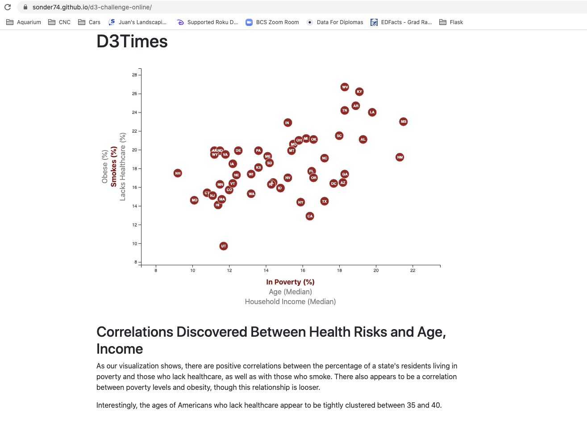
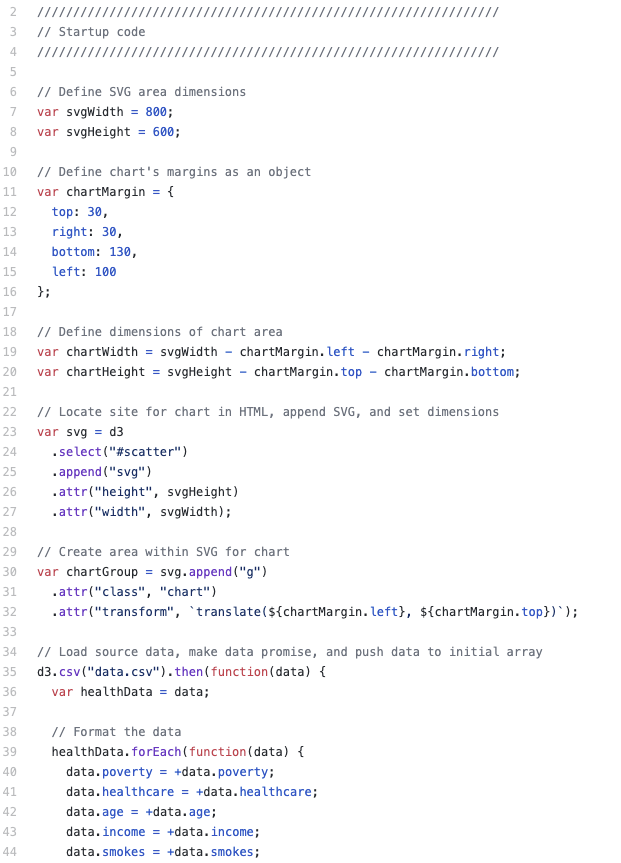
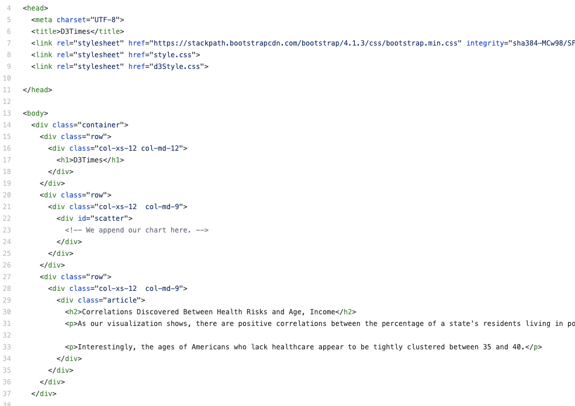

# D3 Challenge (Grade: A+)
 
### Table of Contents:

 1. [Project Goals](#project-goals)
 2. [Tools and Solutions](#tools-and-solutions)
 3. [Outcomes and Lessons Learned](#outcomes-and-lessons-learned)
 4. [Website Screenshot](#website-screenshot)
 5. [Coding Screenshots](#coding-screenshots)
   

## Project Goals
With this project, I was introduced to <a href="https://en.wikipedia.org/wiki/D3.js">D3</a>, a particularly challenging method of using <a href="https://en.wikipedia.org/wiki/JavaScript">JavaScript</a> to render <a href="https://en.wikipedia.org/wiki/Scalable_Vector_Graphics">scalable vector graphics (SVGs)</a> inside web browsers. I was given a set of healthcare data and asked to create a webpage showcasing an interactive, multidimensional chart that gives users the power to customize their own visualizations of the information.

## Tools and Solutions
I began by using D3 to create an SVG to encase my chart, allowing me to locate it within a particular tag in the main page's <a href="https://en.wikipedia.org/wiki/HTML">HTML</a> code. Then I imported the data by building a loop that takes advantage of JavaScript's <a href="https://www.w3schools.com/jsref/jsref_foreach.asp">forEach</a> function. I scaled the chart dynamically using the six of the dataset's different dimensions, appended a D3 scatter plot to the individual datapoints, and created JavaScript <a href="https://www.computerhope.com/jargon/e/event-listener.htm">event listeners</a> for each of the clickable axis categories. The <a href="https://sonder74.github.io/d3-challenge-online/">final product</a> features nine possible combinations of user-designated inputs, with <a href="https://css-tricks.com/controlling-css-animations-transitions-javascript/">transition-and-duration animations</a> courtesy of JavaScript and <a href="https://en.wikipedia.org/wiki/CSS">CSS</a>. You can check out my finished site <a href="https://sonder74.github.io/d3-challenge-online/">here</a>.

## Outcomes and Lessons Learned
D3 isn't as easy to use as tools like <a href="https://matplotlib.org/">Matplotlib</a>, <a href="https://plotly.com/">Plotly</a>, or <a href="https://www.tableau.com/">Tableau</a>, but it does give web designers and data scientists far more control over their visualizations. Combined with JavaScript event listening, D3 allows data specialists to provide users with a deeply interactive experience and render graphics with amazing precision and timing.

## Website Screenshot

## Coding Screenshots

  

